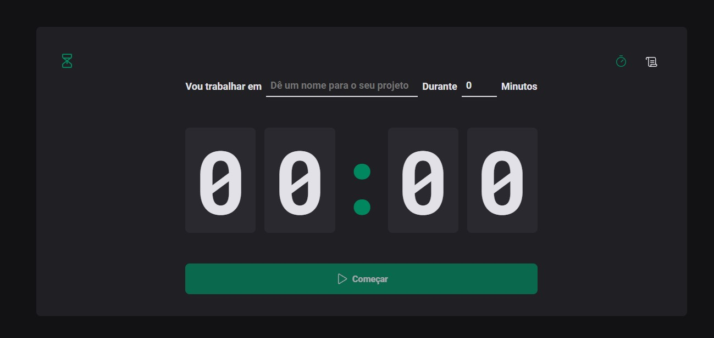
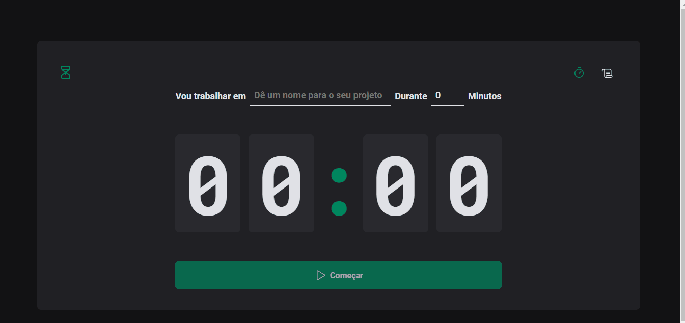
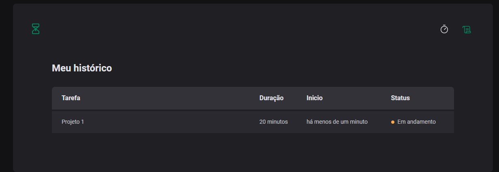
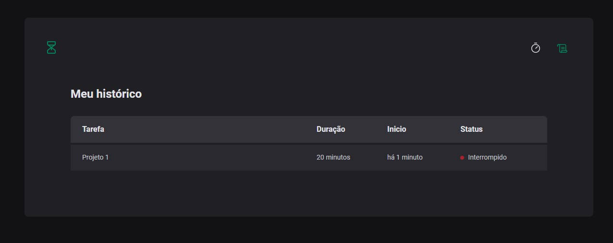

# Task Timer

É uma aplicação que permite o usuario criar ciclos de uma determinada tarefa informando o nome do ciclo e sua duração. 

Os dados do ciclo são salvos no armazenamento local do navegador e são exibidos na página de histórico de ciclos

Os ciclos possuem um status, sendo eles em andamento, concluído e interrompido

Você pode testar a aplicação aqui   

